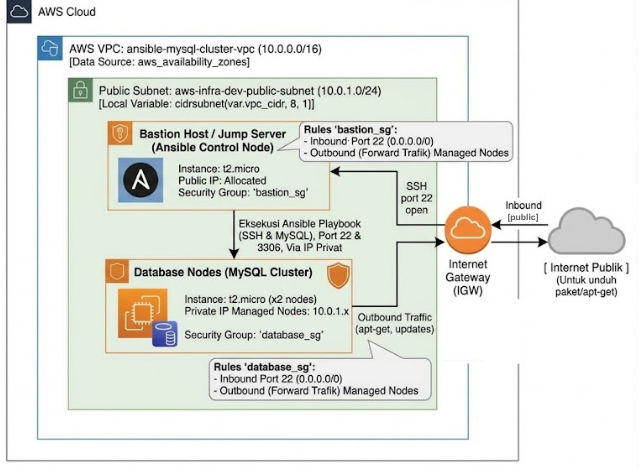

# AWS Infrastructure Provisioning with Terraform

Proyek ini bertujuan untuk mendeploy infrastruktur dasar di AWS secara otomatis menggunakan Terraform. Infrastruktur mencakup VPC, Subnet, Internet Gateway, Security Groups, 1x Bastion Host, dan 2x Database Nodes (Managed Nodes) yang siap dikelola lebih lanjut menggunakan Ansible.

### Arsitektur Infrastruktur
<p align="center">
  
</p>

---

## Prasyarat System (VM Ansible / Ubuntu)

Sistem operasi yang direkomendasikan: **Ubuntu 20.04 LTS / 22.04 LTS / 24.04 LTS**.

### 1. Instalasi Tools Utama (Terraform & AWS CLI)

Jalankan perintah berikut di terminal VM Ubuntu Anda untuk menginstal paket dependensi, AWS CLI v2, dan Terraform:

```bash
# Update paket sistem & install dependensi dasar
sudo apt update && sudo apt install -y unzip curl gnupg software-properties-common git

# Install AWS CLI v2
curl "[https://awscli.amazonaws.com/awscli-exe-linux-x86_64.zip](https://awscli.amazonaws.com/awscli-exe-linux-x86_64.zip)" -o "awscliv2.zip"
unzip awscliv2.zip
sudo ./aws/install
rm -rf awscliv2.zip aws/

# Verifikasi AWS CLI
aws --version

# Install Terraform (Repository Resmi HashiCorp)
wget -O- [https://apt.releases.hashicorp.com/gpg](https://apt.releases.hashicorp.com/gpg) | gpg --dearmor | sudo tee /usr/share/keyrings/hashicorp-archive-keyring.gpg > /dev/null
echo "deb [signed-by=/usr/share/keyrings/hashicorp-archive-keyring.gpg] [https://apt.releases.hashicorp.com](https://apt.releases.hashicorp.com) $(lsb_release -cs) main" | sudo tee /etc/apt/sources.list.d/hashicorp.list
sudo apt update && sudo apt install -y terraform

# Verifikasi Terraform
terraform -v

```

---

## Langkah Deployment Infrastruktur

### 1. Generate SSH Key Pair

SSH Key ini akan terdaftar secara otomatis di AWS EC2 Key Pair untuk akses SSH ke Bastion Host dan Database Nodes.

```bash
# Generate kunci SSH 4096-bit tanpa passphrase (tekan Enter untuk opsi default)
ssh-keygen -t rsa -b 4096 -f ~/.ssh/id_rsa -N ""

# Pastikan public key sudah terbentuk
cat ~/.ssh/id_rsa.pub

```

### 2. Konfigurasi Kredensial AWS

Konfigurasikan akun AWS Anda menggunakan Access Key dan Secret Key dari IAM Console:

```bash
aws configure

```

Masukkan data saat diminta:

* **AWS Access Key ID**: `<Access-Key-Anda>`
* **AWS Secret Access Key**: `<Secret-Key-Anda>`
* **Default region name**: `ap-southeast-1`
* **Default output format**: `json`

### 3. Clone Repository Proyek

Unduh repositori ini ke dalam VM Anda:

```bash
git clone https://github.com/kanjeeng/aws-infra-ansible-mysql.git
cd aws-infra-ansible-mysql

```

---

## Eksekusi Terraform

### 1. Inisialisasi (`terraform init`)

Mendownload provider AWS dan menginisialisasi direktori kerja Terraform:

```bash
terraform init

```

### 2. Validasi & Perencanaan (`terraform plan`)

Memeriksa sintaks dan melihat rancangan perubahan infrastruktur sebelum diterapkan:

```bash
terraform plan

```

### 3. Eksekusi Deployment (`terraform apply`)

Membangun seluruh resource di AWS:

```bash
terraform apply -auto-approve

```

Setelah proses selesai, simpan nilai **Outputs** yang muncul di terminal:

* **bastion_public_ip**: IP Publik untuk Bastion Host.
* **database_nodes_ips**: IP Privat untuk Managed Nodes (Database).
* **vpc_id**: ID VPC yang terbentuk.

---

## Pengujian Akses Remote (SSH)

Gunakan fitur *SSH Agent Forwarding* agar kunci lokal Anda diteruskan saat melompat dari Bastion Host ke Database Node internal:

```bash
# 1. Aktifkan SSH Agent & Daftarkan Kunci
eval "$(ssh-agent -s)"
ssh-add ~/.ssh/id_rsa

# 2. Akses ke Bastion Host dengan Agent Forwarding (-A)
ssh -A ubuntu@<bastion_public_ip>

# 3. Dari dalam Bastion, lompat ke Database Node Privat
ssh ubuntu@<database_private_ip>

```

Atau gunakan *one-liner ProxyJump*:

```bash
ssh -J ubuntu@<bastion_public_ip> ubuntu@<database_private_ip>

```

---

## Menghapus Seluruh Infrastruktur (`terraform destroy`)

Untuk menghapus seluruh infrastruktur AWS yang dibuat oleh proyek ini agar tidak menimbulkan biaya tambahan:

```bash
terraform destroy -auto-approve

```

```